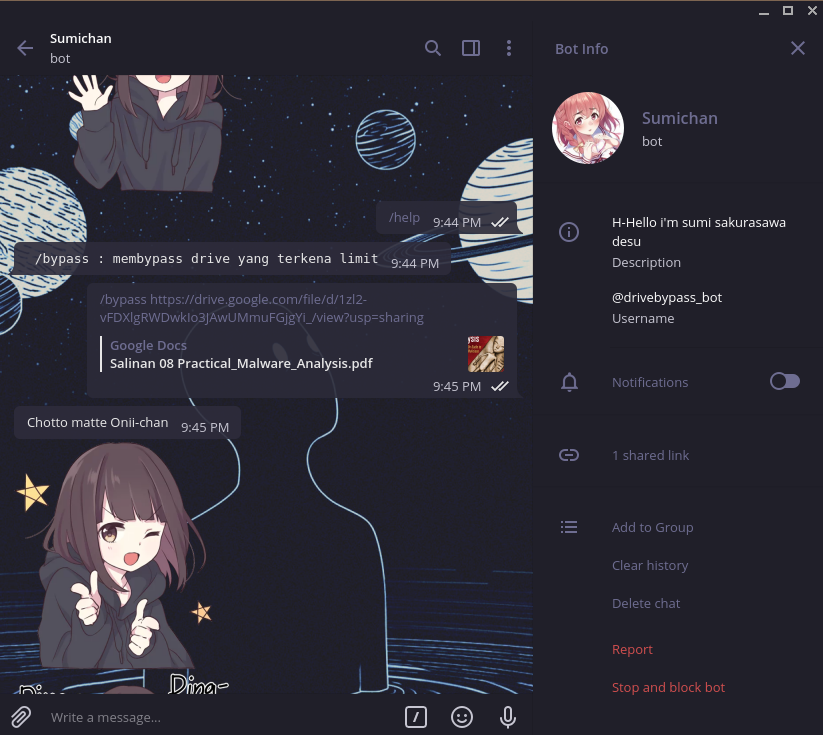
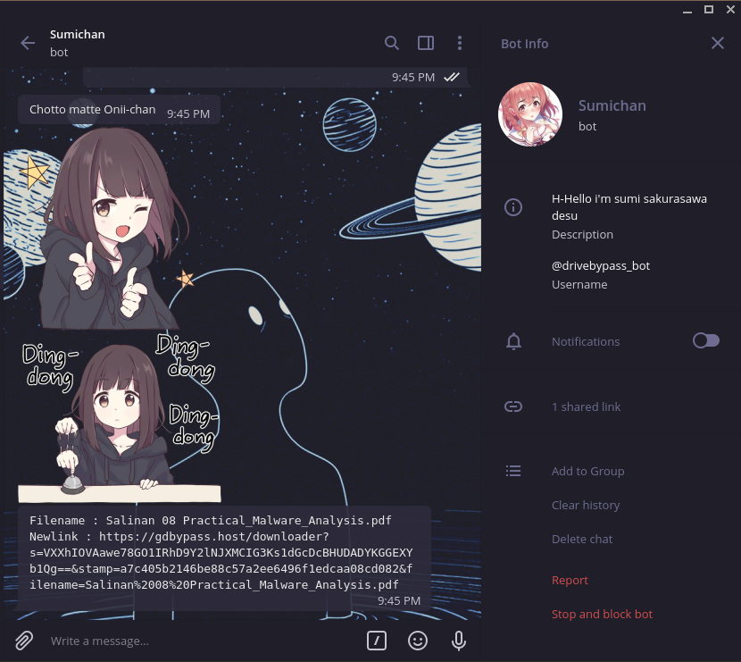

# Description
This is simple bot for bypassing limited google drive via telegram. this bot using Node JS, [Telegraf](https://telegraf.js.org) and [GDbypass Api](https://gdbypass.host)

# Usage
```bash
node index.js
```

# Screenshoot



